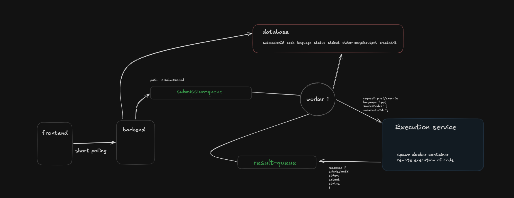

# Compile

A distributed code execution system built using a microservice architecture. Code execution is performed inside isolated Docker containers, while Redis queues enable asynchronous communication between services.

---

## Architecture



---

## Request Flow

```text
POST /submission
Frontend -----------------------> Backend
                                     │
                         Store Submission (PENDING)
                                     │
             Push submissionId → submission-queue
                                     │
                                  Worker
                                     │
                    Update Status → PROCESSING
                                     │
                           POST /execute
                                     │
                           Execution Service
                                     │
                     Execute Code inside Docker
                                     │
          Push Result → execution-results queue
                                     │
                                  Worker
                                     │
                     Update Submission Result
                                     │
                                PostgreSQL
```

---

## Components

- **Frontend** – Submits code and polls for execution status.
- **Backend** – Creates submissions and pushes jobs to the submission queue.
- **Worker** – Consumes Redis queues, communicates with the execution service, and updates the database.
- **Execution Service** – Executes user code inside Docker containers.
- **Redis** – Message broker between services.
- **PostgreSQL** – Stores submissions and execution results.
- **Docker** – Provides isolated execution environments.

---

## Supported Languages

- C++
- JavaScript
- TypeScript
- Python

---

## Tech Stack

- Node.js
- TypeScript
- Express
- PostgreSQL
- Prisma ORM
- Redis
- Docker

---

## How to Use

### 1. Clone the Repository

```bash
git clone <repository-url>
cd <repository-name>
```

### 2. Install Dependencies

```bash
bun install
```

### 3. Configure Environment Variables

Create a `.env` file for each service.

### Backend

```env
DATABASE_URL=
REDIS_URL=
SUBMISSION_QUEUE=submission-queue
```

### Worker

```env
DATABASE_URL=
REDIS_URL=
SUBMISSION_QUEUE=submission-queue
EXECUTION_QUEUE=execution-results
EXECUTION_SERVICE_URL=http://localhost:3002/execute
```

### Execution Service

```env
REDIS_URL=
EXECUTION_QUEUE=execution-results
```

---

### 4. Generate Prisma Client

```bash
bunx prisma generate
```

---

### 5. Build Docker Images

```bash
docker build -t cpp-runner apps/execution-service/docker/cpp
docker build -t node-runner apps/execution-service/docker/node
docker build -t python-runner apps/execution-service/docker/python
```

---

### 6. Start Redis

```bash
docker run -d --name redis -p 6379:6379 redis
```

---

### 7. Run the Services

Start each service in a separate terminal.

**Backend**

```bash
cd apps/backend
bun run dev
```

**Worker**

```bash
cd apps/worker
bun run dev
```

**Execution Service**

```bash
cd apps/execution-service
bun run dev
```

---

### 8. Submit Code

```http
POST /submission
```

Example request:

```json
{
  "code": "#include <iostream>\nusing namespace std;\nint main(){ cout << \"Hello World\"; }",
  "language": "CPP"
}
```

Example response:

```json
{
  "submissionId": "fba0afae-2abc-4c3e-a3e5-4ef87c6f819f",
  "status": "PENDING"
}
```

---

### 9. Check Submission Status

```http
GET /submission/:submissionId
```

Example response:

```json
{
  "status": "SUCCESS",
  "stdout": "Hello World",
  "stderr": "",
  "compileOutput": ""
}
```

---

## Project Structure

```text
apps/
├── backend/
├── worker/
└── execution-service/
    ├── docker/
    │   ├── cpp/
    │   ├── node/
    │   └── python/
    └── src/
        ├── executor/
        ├── lib/
        └── route/
```

---

